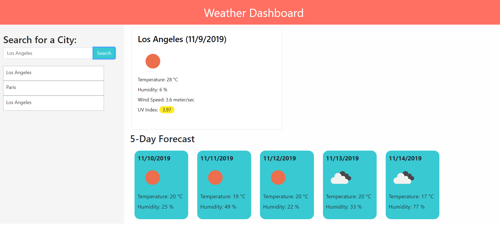

# Weather Dashboard

## Description

This application accesses the open weather API and allows the user to search for a city's current weather and five day forecast. 

The application can be accessed [here.](https://alexandramj92.github.io/weater-dashboard/)

## Usage

The application has an input field to the left and a placeholder that says "City Name" to indicate to the user that they need to input just a city name. 

Below the search field, the past searches are listed and are limited to six. Future project features will include a clickable x next to each past field to allow a user to delete old searches that they are no longer interested in. 

The past searches are also clickable and will initiate the search for that specific city. 

When the user clicks on a past search item and/or inputs a city name to search, the weather dashboard will populate with the current weather in that city on the top of the dashboard and will display the five day forecast at the bottom of the dashboard.

Additionally, the current weather section displays the current UV Index which changes colors depending on how high or low the UV index is. 

The UV Index will change to green between 0-3, yellow between 3-6, orange between 6-8, and red if the UV index is more than 8.

